# Jain AI

[](https://www.python.org/)
[](https://flask.palletsprojects.com/)
[](#how-it-works)
[](#what-it-does)
[](#license)

> **Academic intelligence, grounded in your documents.**
> A modular Flask application combining RAG, OCR, and conversational AI to answer questions from university documents and uploaded files.

---

## Overview

Jain AI is designed for document-grounded academic assistance. Instead of relying on generic chatbot responses, it retrieves relevant content from your local university source documents, extracts text from uploads when needed, and answers in a conversational interface.

It is a good fit for:

- university information assistants
- internal academic help desks
- document-based student support tools
- document-backed chat interfaces that require traceable answers

---

## What It Does

Jain AI is a smart academic assistant built for university contexts. Ask questions about your indexed university documents, upload PDFs or images when needed, and get answers backed by your actual source material instead of generic responses.

| Capability | Description |
|---|---|
| Document Q&A | Ask questions grounded in local university `.txt` and `.pdf` sources using retrieval-augmented generation |
| OCR Support | Extracts text from scanned PDFs and images before querying |
| Session Chat | Maintains per-browser conversation history across a session |
| Modular Design | Clean Flask application factory with a package-based structure |

---

## Getting Started In 60 Seconds

```bash
uv sync
copy .env.example .env
uv run python scripts/index_data.py
uv run app.py
```

Then open:

```text
http://localhost:5000
```

Before indexing, place your source documents under `data/raw/` in the appropriate folders such as `academics/`, `admissions/`, `clubs/`, `hostel/`, or `sports/`.

---

## Visuals

Architecture diagram:



Request flow:



If you want, you can later replace these with UI screenshots or a short demo GIF.
---

## Architecture

The app is organized into focused packages under `src/jain_ai/`:

```text
src/jain_ai/
├── rag/          # Document loading, chunking, indexing, retrieval, routes
├── ocr/          # Text extraction from PDFs and images
├── llm/          # Groq client setup and model calls
├── services/     # Chat, routing, upload, and session logic
├── schemas/      # Request/response data structures
├── db/           # Persistence layer (future expansion)
└── utils/        # Shared helpers: logging, validation, security
```

Full project layout:

```text
jain-ai/
├── app.py
├── wsgi.py
├── pyproject.toml
├── README.md
├── .env.example
├── data/
│   ├── raw/academics/
│   ├── processed/
│   └── uploads/
├── storage/
│   ├── vector_db/
│   ├── logs/
│   └── cache/
├── docs/
├── scripts/
├── static/
├── templates/
└── src/jain_ai/
    ├── app_factory.py
    ├── config.py
    ├── constants/
    ├── db/
    ├── llm/
    ├── ocr/
    ├── rag/
    ├── schemas/
    ├── services/
    └── utils/
```

---

## Quickstart

### 1. Prerequisites

- Python 3.11 or newer
- `uv` recommended for dependency management
- Groq API key for chat and OCR
- Hugging Face sentence-transformer model for embedding-based retrieval

### 2. Install dependencies

```bash
uv sync
```

This project is intended to run from the project-managed environment created by `uv`. For the most reliable setup, use `uv run ...` commands or the local virtual environment interpreter instead of a global Python installation.

Or with a manual virtual environment:

```bash
python -m venv .venv
.venv\Scripts\activate        # Windows
# source .venv/bin/activate   # macOS/Linux
pip install flask groq langchain langchain-chroma langchain-community langchain-huggingface langchain-text-splitters chromadb pymupdf pillow pytest sentence-transformers
```

Note:

- This repository is primarily configured for `uv`
- If you use plain `pip`, install the dependencies listed in `pyproject.toml`

### 3. Set up environment variables

Copy `.env.example` to `.env` and fill in your keys:

```env
GROQ_API_KEY=your-groq-api-key
FLASK_SECRET_KEY=a-long-random-secret
HOST=0.0.0.0
PORT=5000
LOG_LEVEL=INFO
SESSION_COOKIE_SECURE=false
```

Notes:

- `GROQ_API_KEY` is required for chat and OCR-assisted extraction
- Embeddings now run locally with Hugging Face and do not require an OpenAI API key
- Default max upload size is 12 MB
- `.env` should stay local and never be committed

### 4. Add source documents

Place source `.txt` or `.pdf` files anywhere under `data/raw/`. For example:

```text
data/raw/academics/
data/raw/admissions/
data/raw/clubs/
data/raw/hostel/
data/raw/sports/
```

Then index them:

```bash
uv run python scripts/index_data.py
```

### 5. Start the server

```bash
uv run app.py
```

Recommended interpreter:

```text
.venv\Scripts\python.exe
```

By default, the app runs at:

```text
http://localhost:5000
```

Windows note:

If `uv` has a cache permission issue, run the app directly through the virtual environment Python:

```bash
.\.venv\Scripts\python.exe app.py
```

The same fallback works for indexing and reindexing:

```bash
.\.venv\Scripts\python.exe scripts/index_data.py
.\.venv\Scripts\python.exe scripts/reindex_documents.py
```

Reviewer note:

- After cloning the repository, run `uv sync`
- Start the app with `uv run app.py` or `.\.venv\Scripts\python.exe app.py`
- Avoid running `python app.py` from a global/system interpreter, because that may use a different dependency set than the project environment

Health check:

```text
http://localhost:5000/health
```

---

## How It Works

1. Source `.txt` and `.pdf` documents are loaded from `data/raw/`
2. Documents are split into chunks and indexed in Chroma
3. User questions are routed as general chat, RAG, or file-upload requests
4. Uploaded PDFs and images can go through OCR before answering
5. Relative date phrases like `this week` or `this month` are expanded before retrieval so calendar and event queries match dated source material more reliably
6. Responses are generated using Groq models with document context when available

---

## Routes

| Route | Description |
|---|---|
| `/` | Main chat interface |
| `/health` | App health and vector store readiness |
| `/api/ping` | Simple API status check |
| `/admin/status` | Admin readiness check |

---

## Useful Commands

```bash
# Start the app
uv run app.py

# Verify local setup
uv run python scripts/verify_setup.py

# Index documents
uv run python scripts/index_data.py

# Fully rebuild the vector DB after changing or removing source files
uv run python scripts/reindex_documents.py

# Seed local data
uv run python scripts/seed_data.py

# Run tests
uv run pytest
```

If you prefer not to use `uv run`, activate the local virtual environment or call the interpreter directly:

```bash
.\.venv\Scripts\python.exe app.py
.\.venv\Scripts\python.exe -m pytest
```

Note:

- `index_data.py` is best for first-time indexing or add-only updates
- `reindex_documents.py` resets the current Chroma DB and rebuilds it from all current source files
- after a full reindex, restart the Flask app if it was already running

---

## Configuration Notes

Current defaults include:

- Host: `0.0.0.0`
- Port: `5000`
- Max upload size: `12 MB`
- Text model: `openai/gpt-oss-120b`
- Vision model: `meta-llama/llama-4-scout-17b-16e-instruct`
- Embedding model: `sentence-transformers/all-MiniLM-L6-v2`

Persistent and generated directories:

- `data/uploads/` for uploaded files
- `data/processed/` for processed outputs
- `storage/vector_db/` for vector storage
- `storage/logs/` for logs
- `storage/cache/` for temporary cache files

---

## Testing

The test suite under `tests/` covers:

- OCR extraction flows
- RAG retrieval behavior
- Route handling
- File upload processing
- Session state behavior

Run:

```bash
uv run pytest
```

You can also run a single test file during development:

```bash
uv run pytest tests/test_routes.py
```

---

## Production Deployment

Use the WSGI entrypoint with a production server:

```bash
gunicorn wsgi:app
```

If you deploy on Windows or in a platform without Gunicorn, point your process manager to:

```text
wsgi:app
```

---

## Security Checklist

- Never commit `.env` or real API keys
- Use a strong random `FLASK_SECRET_KEY` in non-local environments
- Set `SESSION_COOKIE_SECURE=true` behind HTTPS
- Keep `.env` listed in `.gitignore`
- Rotate any key immediately if it has ever been committed

---

## Documentation

| Doc | Contents |
|---|---|
| `docs/api.md` | API endpoints and request/response formats |
| `docs/architecture.md` | System design and component relationships |
| `docs/deployment.md` | Production deployment guidance |
| `docs/rag_pipeline.md` | RAG pipeline internals |

Suggested reading order for new contributors:

1. `docs/architecture.md`
2. `docs/rag_pipeline.md`
3. `docs/api.md`
4. `docs/deployment.md`

---

## Tech Stack

- Flask
- Chroma
- Hugging Face Embeddings
- Groq
- PyMuPDF
- Pillow
- Python 3.11+

---

## Current Status

This repository is actively being modularized from a single-file prototype into a package-based Flask application. If you see import or environment issues while running locally, verify:

- your `.env` values are present
- your dependencies were installed successfully
- your source documents are placed under `data/raw/`
- your vector store can be created under `storage/vector_db/`

---

## Contributing

If you are extending the project:

- keep secrets out of source files and commits
- prefer small, focused modules under `src/jain_ai/`
- add or update tests when changing routes, OCR, or retrieval behavior
- document new scripts, routes, or environment variables in this README and `docs/`

---

## License

Add your preferred license before public distribution.
